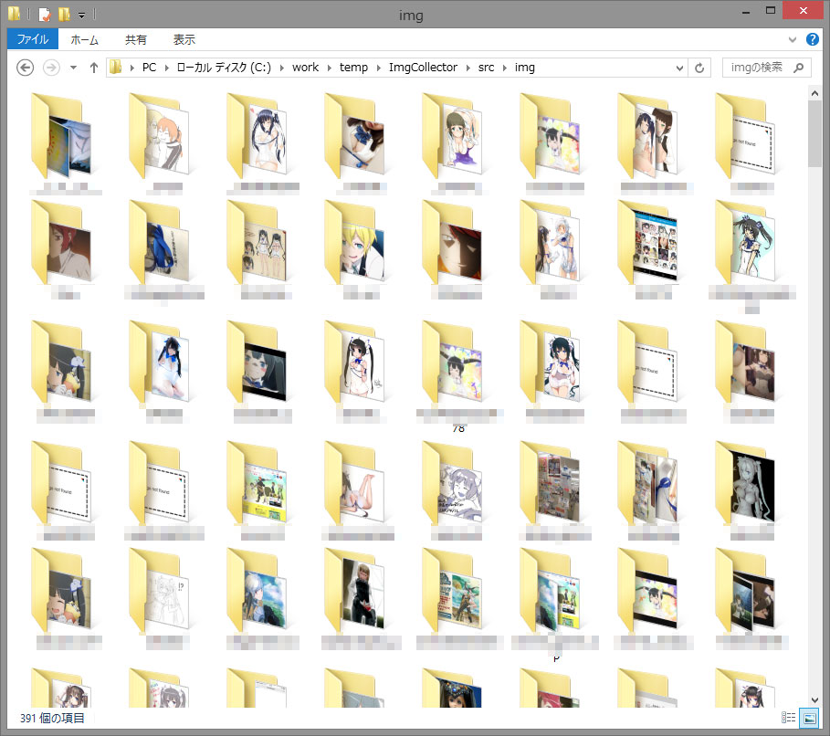

# Twitter Imagehunter

### 必要なもの
+ php
+ php-pecl-oauth
+ php-curl (php-common)
+ Twitterのアカウント、アプリ作成(https://apps.twitter.com/)

### Usage
1. `config.php` を編集して以下を埋めましょう。それぞれのキー、トークンはアプリを作成すると手に入ります。
  + CONSUMER_KEY
  + CONSUMER_SECRET
  + ACCESS_TOKEN
  + ACCESS_TOKEN_SECRET
2. コマンドラインから以下を実行しましょう。

~~twitter_imagehunter_s.php の検索引数を省略すると紐神様が大量に降ってきます~~

```
php twitter_imagehunter.php <twitter_screen_name>
```

```
php twitter_imagehunter_s.php <some_keyword>
```


